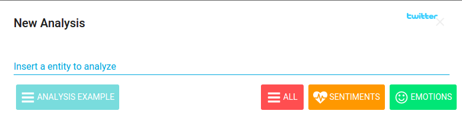
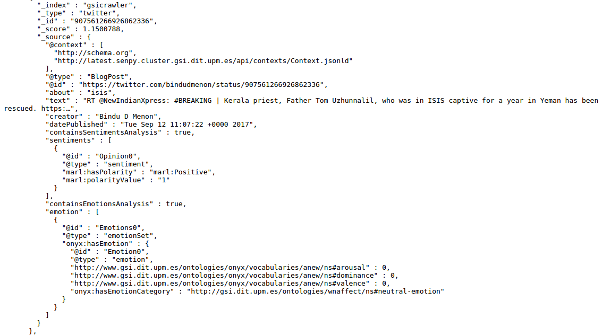

What is GSI Crawler?
----------------

GSI Crawler [#f1]_ is an innovative and useful framework which enables to examine social networks and opinion websites by applying sentiment and emotion analysis techniques. At the moment, there are two available platforms: Twitter and Reddit. The user interacts with the tool through a web interface, selecting the analysis type that wants to carry out and the platform that is going to be examined. Depending on the platform  selected, some aditional resources may be required, such as the URL of the specific content that will be analyzed.

In this documentation we are going to introduce the framework presented above, detailing the global architecture of the project and explaining each module functionalities. Finally we will expose most relevant scenarios inside a case study in order to better understand the system itself. 

Architecture
----------------

Overview
~~~~~~~~~~~~~~~~~~~~~

GSI Crawler environment can be defined from a high level point of view as follows:

* **Data Acquisition**: this is the core function of GSI Crawler, consisting on extracting data according to the petitions sent to it. It works thanks to the use of web crawlers, which will be explained in more detail in the Modules section.

* **Semantic Representation**: apart from obtaining data, they will be processed following semantic paradigms apart from conventional ones.

* **Data Storage**: once a request is made, its response will be stored with the aim of processing or visualising when needed.

Modules
~~~~~~~~~~~~~~~~~~~~~

The following figure describes the architecture from a modular point of view, being each of the modules described below.

.. image:: images/arch.png
  :align: center

Web App - Polymer Web Components
^^^^^^^^^^^^^^^^^^^^^^^^^^^^^^^^^^^^^^
As we explained in section before, the GSI Crawler framework uses a webpage based on Polymer web components to interact with all the functionalities offered by the tool. These Polymer Web Components are simply independent submodules that can be grouped each other to build the general dashboard interface. In this section we are going to present those components which actively participate in the main application workflow.

The GSI Crawler web interface looks like the image presented below,

.. image:: images/gsicrawler-interface.png
  :align: center

Inside this user interface we can notice several interesting components represented in the figure:

.. image:: images/floating-button.png
  :align: left

**Begin to explore** : This is the main input element within the web interface and enables to request a new analysis task for any available platform. It also needs a certain reference about the product or place to be analyzed.

|
.. image:: images/floating-button-platforms.png
  :align: left

**Available platforms** : Due to the high scalability offered by the GSI Crawler framework, it allows to perform analysis tasks inside several third party platforms or websites, such as social networks or any other content. The tool has included by default the *Twitter* and *Reddit* scrapers, being able to extract the opinions from a given link.

|

**Choose the analysis** : Once the content provider is selected, a card will pop up to select the analysis type and include the URL of the resource that is going to be treated.

|

**Observe and profundize into the result** : Finally, the result will be presented in the dashboard showing the result for the requested analysis. 

Tasks Server
^^^^^^^^^^^^^^^^^^^^^^^^^^^^^^^^^^^^^^

The tasks server is responsible of managing the incoming workflow and setting up a valid pipeline to obtain, analyze, organize and save the results in Fuseki or elasticSearch to be displayed in the client application. Luigi framework is used as an orchestator to build a sequence of tasks in order to facilitate the analysis process. 

The main goal of the server is to provide an API REST to add new tasks to the Luigi queue, saving the result in elasticSearch instance and retrieving it asyncronously from the client website. This web service has been implemented using Python Flask library, and contains multiple API calls to queuing tasks depending on the platform selected. 

All the pipelines has the same structure, represented in figure below

.. image:: images/picLuigi.png
  :scale: 80%
  :align: center

As is represented above, pipelines architecture is divided into three main steps, *Fetch*, *Analyze*, *Semantic* and *Save*:

* **Fetch** refers to the process of obtaining tweets, comments or whatever is desired to be analyzed, from the URL provided. Most of the times, this task involves webpage parsing, recognizing valuable information contained inside html tags and building a new JSON file with only these data. This process is commonly known as *scrapping* a website. In order to facilitate this filtering process exists multiple extensions or library that offers a well-formed structure to carry out this task being less tedious. Inside the Tasks Server, we have imported the Scrapy library in order to agilize the data mining process. Scrapy is an open source and collaborative framework for extracting the data you need from websites, in a fast, simple, yet extensible way. It is based on sub classes named *spiders*, where are contained the required methods to extract the information. The GSI Crawler application has available two spiders for each Twitter and Reddit platform respectively. So to conclude, this task focus on extract the valuable data and generate a JSON which contains all the sentences that will analyze the following task in the pipeline.

* **Analyze** task is responsible of take the input JSON file generated by the previous task, parse it and analyze each text strign using Senpy remote server for it. Senpy service is based on HTTP calls, obtaining an analyzed result for the text attached in the request. Once the task has collected the analysis result, it generates another JSON containing the original sentence and its analysis result.

* **Semantic** task aims to structure data into triplets so as to be understood by the different ontologies supported. It takes as input the original JSON data and returns another JSON with the desired structure.

* **Save** process consists on store the JSON generated previously which contains the analysis result inside elasticSearch instance or Fuseki. ElasticSearch is a distributed, RESTful search and analytics engine capable of solving a growing number of use cases. As the heart of the Elastic Stack, it centrally stores the data so you can discover the expected and uncover the unexpected. To carry put the saving process its necessary to provide two arguments, the **index**, which represents the elastic index where the information will be saved, and the **doc type**, which allows to categorize information that belongs to the same index. It exists a third parameter which is the **id** of the query, but it is automatically generated by default.

To better understand these concepts, we are going to give a clear example that shows how the storing process works internally. Imagine that the user requests a **sentiment** analysis for a certain **Tweet**. One elasticSearch parameters approach that would fit could be, **twitter** as the elasticSearch *index*, **sentiment** as the *doc type* because there could exist an emotion within the same platform, and lastly the *id* that could be the **datetime** when the task request was triggered.

Once the Luigi orchestator has been explained, we will conclude this section detailing how the server behaves when it receives a user request, and what parameters are mandatory to run the operation. The RESTful API workflow is shown in diagram below:

.. image:: images/task-diagram.png
  :align: center

Install
-------

GSI Crawler installation is based in docker containers, so it is required to have both docker and docker-compose installed.

For docker installation in Ubuntu, visit this `link <https://store.docker.com/editions/community/docker-ce-server-ubuntu?tab=description>`_.

Docker-compose installation detailed instructions are available `here <https://docs.docker.com/compose/install/>`_.

First of all, you need to clone the repository:

.. code:: bash

   $ git clone https://lab.cluster.gsi.dit.upm.es/sefarad/gsicrawler.git
   $ cd gsicrawler

Then, it is needed to set up the environment variables. For this task, first create a file named ``.env`` in the root directory of the project. Once you have created the file, you should add a new attribute for the luigi service in the file called ``docker-compose.yml``, being ``.env`` its value.

Finally, to run the image:

.. code:: bash

    $ sudo docker-compose up  

.. rubric:: References

.. [#f1] José Emilio Carmona. (2016). Development of a Social Media Crawler for Sentiment Analysis.
.. [#f2] J. Fernando Sánchez-Rada, Carlos A. Iglesias, Ignacio Corcuera-Platas & Oscar Araque (2016). Senpy: A Pragmatic Linked Sentiment Analysis Framework. In Proceedings DSAA 2016 Special Track on Emotion and Sentiment in Intelligent Systems and Big Social Data Analysis (SentISData).
.. [#f3] http://elastic.co.

