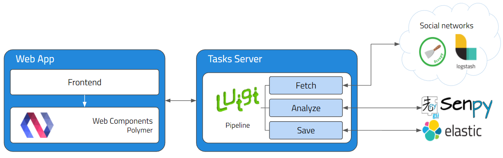
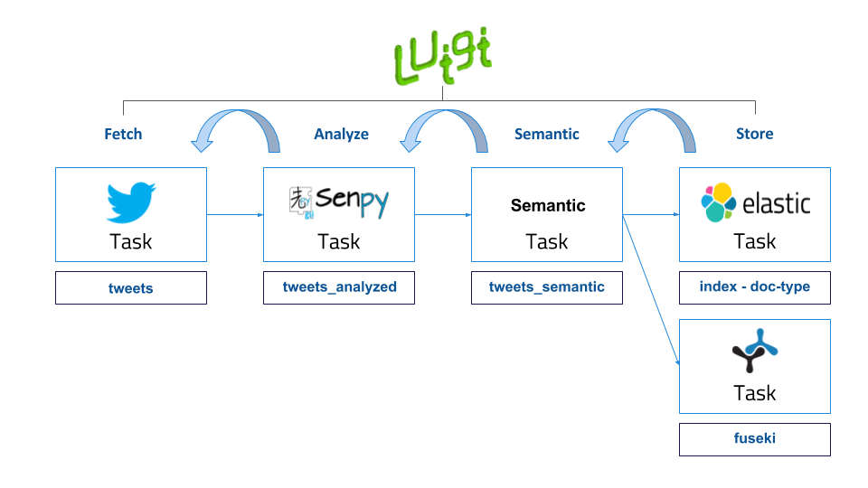
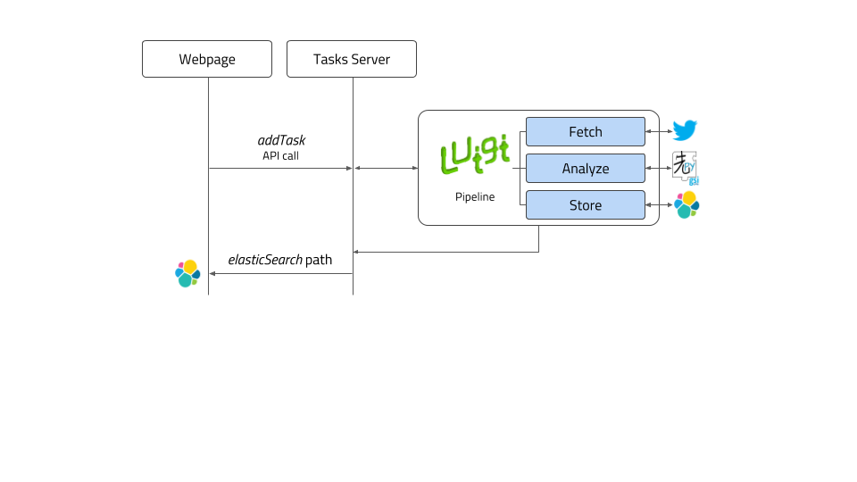
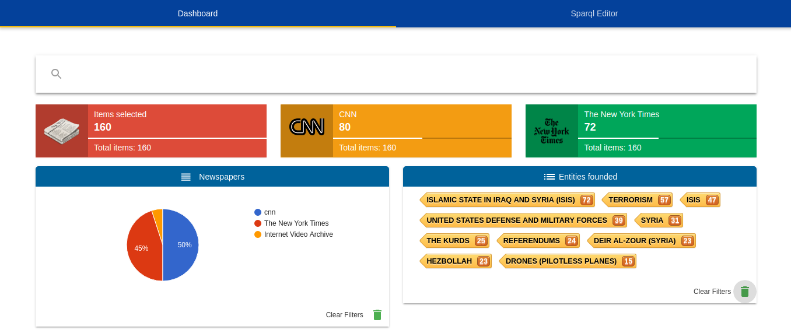
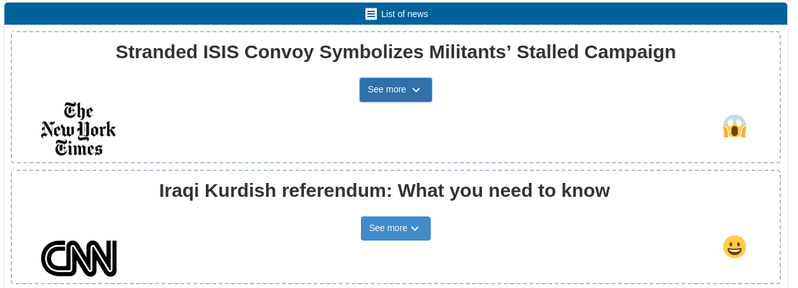

What is GSI Crawler?
----------------

GSI Crawler [#f1]_ is an innovative and useful framework which aims to extract information from web pages enriching following semantic approaches. At the moment, there are three available platforms: Twitter, Reddit and News. The user interacts with the tool through a web interface, selecting the analysis type he wants to carry out and the platform that is going to be examined.

In this documentation we are going to introduce this framework, detailing the global architecture of the project and explaining each module functionality. Finally we will expose most a case study in order to better understand the system itself. 

Architecture
----------------

Overview
~~~~~~~~~~~~~~~~~~~~~

GSI Crawler environment can be defined from a high level point of view as follows:

* **Data Ingestion**: this is the core function of GSI Crawler, consisting on extracting data according to the petitions sent to it. It works thanks to the use of web crawlers, which will be explained in more detail in the Modules section.

* **Semantic Representation**: before its storage, data will be enriched following semantic paradigms in order to allow a more powerful analysis later.

* **Data Storage**: after data acquisition and enrichment, the storage process is carried out. At this moment, both ElasticSearch and Fuseki are available for fulfulling this task.

Modules
~~~~~~~~~~~~~~~~~~~~~

The following figure describes the architecture from a modular point of view, being each of the modules described below.

Tasks Server
^^^^^^^^^^^^^^^^^^^^^^^^^^^^^^^^^^^^^^

The tasks server is responsible of managing the incoming workflow and setting up a valid pipeline to obtain, analyze, organize and save the results in Fuseki or ElasticSearch to be displayed in the client application. Luigi framework is used as an orchestator to build a sequence of tasks in order to facilitate the analysis process. 

This tasks server is activated periodically by an administrator of processes called cron, whose aim is to obtain more information everyday. That way, any user can visualize data any time with the certainty that there will be stored data in the system.

All the pipelines have the same structure, as represented in the figure below.

As is represented above, pipelines architecture is divided into three main steps, *Fetch*, *Analyze*, *Semantic* and *Save*:

* **Fetch** refers to the process of obtaining tweets, comments or any content which is desired to be analyzed, from the provided URL. Most of the times, this task involves webpage parsing, recognizing valuable information contained inside html tags and building a new JSON file with the selected data. This process is commonly known as *scraping* a website. In order to facilitate this filtering process,there exist multiple extensions or libraries that offer a well-formed structure to carry out this task in a more comfortable way. Inside the Tasks Server, we have imported the Scrapy library in order to agilize the data mining process. Scrapy is an open source and collaborative framework for extracting the data from websites, in a fast, simple, yet extensible way. It is based on sub classes named *spiders*, which contain the required methods to extract the information. Apart from the use of the Scrapy library, several APIs have also been used for retrieving data. The GSI Crawler application has three available scrapers, one for each Twitter and Reddit platform, and another one which includes spiders for different news sources. So to conclude, this task focuses on extracting the valuable data and generates a JSON which can be analyzed by the following task in the pipeline.

* **Analyze** task is responsible of taking the input JSON file generated by the previous task, parsing it and analyzing each text strign using Senpy remote server for it. Senpy service is based on HTTP calls, obtaining an analyzed result for the text attached in the request. Once the task has collected the analysis result, it generates another JSON containing the original sentence and its analysis result.

* **Semantic** task aims to structure data into triplets so as to be understood by the different ontologies supported. It takes as input the original JSON data and returns another JSON with the desired structure.

* **Store** process consists on storing the JSON generated previously which contains the analysis result inside elasticSearch instance or Fuseki. ElasticSearch is a distributed, RESTful search and analytics engine capable of solving a growing number of use cases. As the heart of the Elastic Stack, it centrally stores the data so it is possible to discover the expected and uncover the unexpected. To carry out the saving process, it's necessary to provide two arguments, the **index**, which represents the elastic index where the information will be saved, and the **doc type**, which allows to categorize information that belongs to the same index. It exists a third parameter which is the **id** of the query, but it is automatically generated by default.

To better understand these concepts, we are going to give a clear example that shows how the pipeline processes work internally. Imagine that the user requests a **sentiment** analysis for a certain **Tweet**. One elasticSearch parameters approach that would fit could be, **twitter** as the elasticSearch *index*, **sentiment** as the *doc type* because there could exist an emotion within the same platform, and lastly the *id* that could be the **datetime** when the task request was triggered.

Once the Luigi orchestator has been explained, we will conclude this section detailing how the server behaves when it receives a user request, and what parameters are mandatory to run the operation. The workflow is shown in diagram below:

Web App - Polymer Web Components
^^^^^^^^^^^^^^^^^^^^^^^^^^^^^^^^^^^^^^
GSI Crawler framework uses a webpage based on Polymer web components to interact with all the functionalities offered by the tool. These Polymer Web Components are simply independent submodules that can be grouped each other to build the general dashboard interface. In this section we are going to present those components which actively participate in the main application workflow.

This example shows the representation of data obtained from the News scraper.

|

The list of news obtained which fits the selected filters is shown as represented in the following image. The headline of each news item appears along with the logo of its source and the emotion analysis representation of its content, displayed as an emoji.

|

|

Additionaly, it is possible to use the Sparql editor to execute semantic queries which work making use of several ontologies in order to enrich the gathered data.

.. image:: images/news3.png
  :align: left

Install
-------

GSI Crawler installation is based in docker containers, so it is required to have both docker and docker-compose installed.

For docker installation in Ubuntu, visit this `link <https://store.docker.com/editions/community/docker-ce-server-ubuntu?tab=description>`_.

Docker-compose installation detailed instructions are available `here <https://docs.docker.com/compose/install/>`_.

First of all, you need to clone the repository:

.. code:: bash

   $ git clone https://lab.cluster.gsi.dit.upm.es/sefarad/gsicrawler.git
   $ cd gsicrawler

Then, it is needed to set up the environment variables. For this task, first create a file named ``.env`` in the root directory of the project. Once you have created the file, you should add a new attribute for the luigi service in the file called ``docker-compose.yml``, being ``.env`` its value.

Finally, to run the image:

.. code:: bash

    $ sudo docker-compose up  

Tutorial
--------

In this section we are going to build a Crawler from scratch, making use of the CNN news crawler as a reference. A pre-requirement for building a scraper is understanding how Luigi pipelines work. Essentialy, they are a concatenation of tasks compound by certain parameters which execute a concrete function and return and output which is used by the following task. The dependencies of tasks are described semantically as "one task requires another". For a better understanding of Luigi, please visit this `documentation <https://luigi.readthedocs.io/en/stable/>`_.

As it was shown in the tasks server diagram, the first task is related to the obtention of data. In this case, the scraper will use the CNN API for news, so the information to be extracted is obtained from a JSON returned by accessing a certain endpoint. In other cases, the information has to be extracted making use of the `Scrapy <https://docs.scrapy.org/en/latest/>`_ library, which allows to extract data allocated between HTML tags in an easy way using CSS selectors. 

So, the first step is to create that script that is in charge of extracting the desired data. Additionaly, data is required to be organised according to `schema.org`. For achieving this, in our example we should look to the `NewsArticle <http://schema.org/NewsArticle>`_ entity to know how to structure our data fields. The result of each collected news item contains the following attributes, whose name is specified in the schema reference. The Python dictionary depicted below should be saved as a JSON in order to be understood by the following task.

.. code-block:: python
      
  aux = dict()
  aux["type"] = "NewsArticle"
  aux["@id"] = newsitem["url"]
  aux["datePublished"] = newsitem["firstPublishDate"]
  aux["dateModified"] = newsitem["lastModifiedDate"]
  aux["articleBody"] = newsitem["body"]
  aux["about"] = newsitem["topics"]
  aux["author"] = newsitem["source"]
  aux["headline"] = newsitem["headline"]
  aux["search"] = search
  aux["thumbnailUrl"] = newsitem["thumbnail"] ##########
  news.append(aux)

This script is called from a task like shown in the image below. As this is the first task, it doesn't require any other task. 

.. code-block:: python
  
  class ScrapyTask(luigi.Task):
      """
      Generates a local file containing 5 elements of data in JSON format.
      """ 
      url = luigi.Parameter()

      id = luigi.Parameter()

      analysisType = luigi.Parameter()

      def run(self):
          """
          Writes data in JSON format into the task's output target.
          The data objects have the following attributes:
          * _id is the default Elasticsearch id field,
          * text: the text,
          * date: the day when the data was created.
          """
          filePath = '/tmp/_scrapy-%s.json' % self.id
          retrieveCnnNews(self.url, 10, filePath)
          retrieveNytimesNews(self.url, 10, filePath)

      def output(self):
          """
          Returns the target output for this task.
          In this case, a successful execution of this task will create a file on the local filesystem.
          :return: the target output for this task.
          :rtype: object (🇵🇾class:luigi.target.Target)
          """
          return luigi.LocalTarget(path='/tmp/_scrapy-%s.json' % self.id)

The second step requires reading the information extracted from the first one, which was stored in a JSON file, and enriching it with a sentiment and emotion analysis. In our case, we have used the Senpy service, which returns the sentiment score of each news article according to Marl ontology and the emotion analysis according to Onyx ontology. As a result of this process, the returned JSON contains three additional fields: sentiment, polarity (the score associated to the sentiment field) and emotion. This code would look like this (if senpy service was used):

.. code-block:: python
  
  if 'sentiments' in self.analysisType:
      i["containsSentimentsAnalysis"] = True
      r = requests.get('http://test.senpy.cluster.gsi.dit.upm.es/api/?algo=sentiment-tass&i=%s' % i["text"])
      response = r.content.decode('utf-8')
      response_json = json.loads(response)
      i["sentiments"] = response_json["entries"][0]["sentiments"]
  if 'emotions' in self.analysisType:
      i["containsEmotionsAnalysis"] = True
      r = requests.get('http://test.senpy.cluster.gsi.dit.upm.es/api/?algo=emotion-anew&i=%s' % i["text"])
      response = r.content.decode('utf-8')

The following tasks would be storing the generated JSON in the previous tasks in the desired way according to one or more database schemes. After that, the visualization part has to be developed. For creating a dashboard, follow this `documentation <http://sefarad.readthedocs.io/en/latest/dashboards-dev.html>`_.

.. rubric:: References

.. [#f1] José Emilio Carmona. (2016). Development of a Social Media Crawler for Sentiment Analysis.
.. [#f2] J. Fernando Sánchez-Rada, Carlos A. Iglesias, Ignacio Corcuera-Platas & Oscar Araque (2016). Senpy: A Pragmatic Linked Sentiment Analysis Framework. In Proceedings DSAA 2016 Special Track on Emotion and Sentiment in Intelligent Systems and Big Social Data Analysis (SentISData).
.. [#f3] http://elastic.co.

